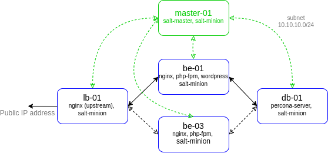

# lab-11
otus | saltstack

### Домашнее задание
Управление конфигурацией на несколько серверов

#### Цель:
настроить управление конфигурацией проекта ( предыдущее ДЗ) через salt

#### Описание/Пошаговая инструкция выполнения домашнего задания:
добавить в проект salt server;
добавить на конечные ноды миньоны солта;
настроить управление конфигурацией nginx и iptables.

#### Критерии оценки:
Статус "Принято" ставится при выполнении перечисленных требований.


### Выполнение домашнего задания

#### Создание стенда

Стенд будем разворачивать с помощью Terraform на Proxmox, настройку серверов будем выполнять с помощью Saltstack.

Необходимые файлы размещены в репозитории GitHub по ссылке:
```
https://github.com/SergSha/lab-11.git
```

Схема:



Для начала получаем OAUTH токен:
```
https://cloud.yandex.ru/docs/iam/concepts/authorization/oauth-token
```

Настраиваем аутентификации в консоли:
```
export YC_TOKEN=$(yc iam create-token)
export TF_VAR_yc_token=$YC_TOKEN
```

Скачиваем проект с гитхаба:
```
git clone https://github.com/SergSha/lab-11.git && cd ./lab-11
```

В файле provider.tf нужно вставить свой 'cloud_id':
```
cloud_id  = "..."
```

При необходимости в файле main.tf вставить нужные 'ssh_public_key' и 'ssh_private_key', так как по умолчанию соответсвенно id_rsa.pub и id_rsa:
```
ssh_public_key  = "~/.ssh/id_rsa.pub"
ssh_private_key = "~/.ssh/id_rsa"
```

Для того чтобы развернуть стенд, нужно выполнить следующую команду:
```
terraform init && terraform apply -auto-approve && \
sleep 60 && ansible-playbook ./provision.yml
```

По завершению команды получим данные outputs:
```
Outputs:

backend-servers-info = {
  "backend-01" = {
    "ip_address" = tolist([
      "10.10.10.8",
    ])
    "nat_ip_address" = tolist([
      "",
    ])
  }
  "backend-02" = {
    "ip_address" = tolist([
      "10.10.10.16",
    ])
    "nat_ip_address" = tolist([
      "",
    ])
  }
}
consul-servers-info = {
  "consul-01" = {
    "ip_address" = tolist([
      "10.10.10.17",
    ])
    "nat_ip_address" = tolist([
      "",
    ])
  }
  "consul-02" = {
    "ip_address" = tolist([
      "10.10.10.25",
    ])
    "nat_ip_address" = tolist([
      "",
    ])
  }
  "consul-03" = {
    "ip_address" = tolist([
      "10.10.10.4",
    ])
    "nat_ip_address" = tolist([
      "",
    ])
  }
}
db-servers-info = {
  "db-01" = {
    "ip_address" = tolist([
      "10.10.10.20",
    ])
    "nat_ip_address" = tolist([
      "",
    ])
  }
}
iscsi-servers-info = {
  "iscsi-01" = {
    "ip_address" = tolist([
      "10.10.10.24",
    ])
    "nat_ip_address" = tolist([
      "",
    ])
  }
}
nginx-servers-info = {
  "nginx-01" = {
    "ip_address" = tolist([
      "10.10.10.3",
    ])
    "nat_ip_address" = tolist([
      "158.160.23.202",
    ])
  }
  "nginx-02" = {
    "ip_address" = tolist([
      "10.10.10.12",
    ])
    "nat_ip_address" = tolist([
      "158.160.1.253",
    ])
  }
}
```

На всех серверах будут установлены ОС Almalinux 8, настроены смнхронизация времени Chrony, система принудительного контроля доступа SELinux, в качестве firewall будет использоваться NFTables.

Стенд был взят из лабораторной работы 5 https://github.com/SergSha/lab-05. Consul-server развернём на кластере из трёх нод consul-01, consul-02, consul-03. На балансировщиках (nginx-01 и nginx-02) и бэкендах (backend-01 и backend-02) будут установлены клиентские версии Consul. На баланcировщиках также будут установлены и настроены сервис consul-template, которые будут динамически подменять конфигурационные файлы Nginx. На бэкендах будут установлены wordpress. Проверка (check) на доступность сервисов на клиентских серверах будет осуществляться по http.

Так как на YandexCloud ограничено количество выделяемых публичных IP адресов, в качестве JumpHost, через который будем подключаться по SSH (в частности для Ansible) к другим серверам той же подсети будем использовать сервер nginx-01.

Список виртуальных машин после запуска стенда:


Для проверки работы стенда воспользуемся установленным на бэкендах Wordpress:


Значение IP адреса сайта можно получить от одного из балансировщиков, например, nginx-01:


